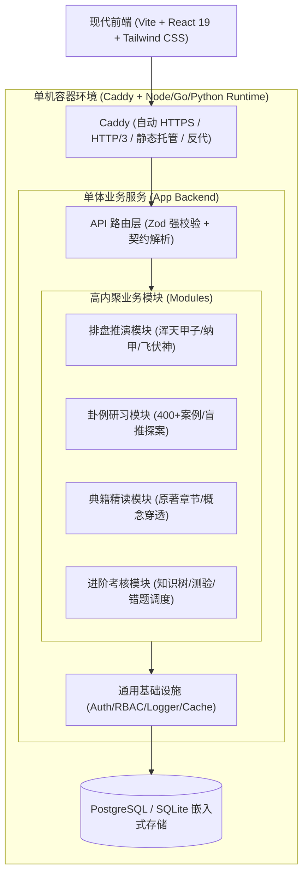

# 01. 系统总体架构与分层设计规范

## 1. 总体架构拓扑 (Modular Monolith)

## 2. 三层分层职责边界

| 分层 | 允许的职责 | 严禁的越权行为 |
| :--- | :--- | :--- |
| **API / Controller 层** | 接收请求、执行 Zod/Schema 强校验、解析 Session/Token、调用 Service、包装统一响应结构体。 | 严禁直接写 SQL、严禁编写复杂业务逻辑、严禁直接操作文件系统或外部下游。 |
| **Service 业务逻辑层** | 组合核心领域逻辑、执行事务（Transaction）、计算排盘干支生克、调用数据访问接口。 | 严禁依赖 HTTP Request/Response 对象（保持纯函数/可单测性）。 |
| **Data / Repository 层** | 封装 ORM（Prisma / Drizzle / TypeORM）查询、原生 SQL 优化、数据读写与映射。 | 严禁在此处做业务权限判定或复合业务分支判断。 |
