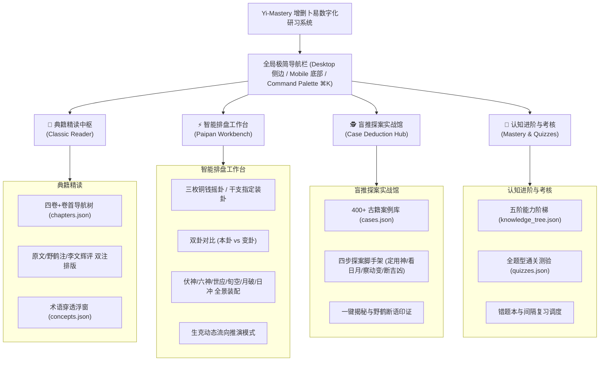

# 第 1 轮规范：全局信息架构、用户旅程与新中式视觉规范

> **⚠️ 部分废弃**：项目已重定位为个人研习工具。视觉规范（配色/排版/微动效）仍沿用，但本文档中的导航 IA（"盲推探案""认知进阶"两个 Tab）、新手模式（小白模式开关）、零基础用户旅程已废弃——见 04/05/06 号文档的废弃说明。当前导航仅保留"智能排盘""典籍精读"，新增模块随实施进度补充。

> **规范版本**：v1.0 (已通过第 1 轮三方独立评审与修正)  
> **制定主体**：资深产品设计师 & 现代教育家

---

## 1. 全局信息架构 (Information Architecture)

系统根据现代认知负载模型，将《增删卜易》的所有数据和功能归纳为 **四大核心功能中枢（Hubs）** 与 **一条极简全局交互带**：

---

## 2. 新中式极简（Neo-Chinese Minimalist）视觉设计系统

### 2.1 调色板系统 (Color Tokens)

设计理念：摒弃传统黄历软件的杂乱高饱和度，采用**“古籍纸质温润底色 + 水墨基调 + 朱砂点睛 + 五行自然语义色”**。

| Token 名称 | 颜色值 (Light) | 颜色值 (Dark) | 语义说明 |
| :--- | :--- | :--- | :--- |
| `--bg-canvas` | `#FBF9F5` (温润宣纸白) | `#121413` (玄墨暗底) | 应用主背景，减少视觉疲劳 |
| `--bg-surface` | `#FFFFFF` (纯净素白) | `#1C1F1E` (石板墨灰) | 卡片、弹窗与工作台背景 |
| `--text-primary` | `#1F2421` (松烟浓墨) | `#EDECE8` (素纸白字) | 标题、主正文 |
| `--text-secondary` | `#5C6460` (焦茶灰) | `#9EA8A3` (淡墨灰) | 次级说明、注释、作者注 |
| `--text-tertiary` | `#8F9893` (素宣浅灰) | `#5A635E` (暗纹灰) | 辅助标注、占位符、边线 |
| `--brand-cinnabar` | `#C0392B` (朱砂赤红) | `#E74C3C` (朱砂鲜红) | 动爻标记、世爻高亮、关键警示、主动交互点 |
| `--brand-ochre` | `#9C6634` (熟褐赤金) | `#D49B5B` (暖金琥珀) | 应爻标记、伏神标示、重点知识徽章 |
| `--border-subtle` | `#E8E4DB` (古绢细线) | `#2A2E2C` (暗墨边线) | 分割线与卡片边框 |

#### 五行语义色（严格对应生克可视化）
- **木 (Wood)**：`#2E7D32` (松柏绿)
- **火 (Fire)**：`#D84315` (枫叶朱)
- **土 (Earth)**：`#8D6E63` (岩土褐)
- **金 (Metal)**：`#D4AF37` / `#78909C` (明金青灰)
- **水 (Water)**：`#1565C0` (幽渊青蓝)

### 2.2 字体排印体系 (Typography)

- **中文字体栈**：`"Noto Serif SC", "Source Han Serif SC", "Songti SC", "STSong", serif`（典籍正文与卦名展示优雅典雅宋体韵味）。
- **界面与数字字体栈**：`system-ui, -apple-system, "PingFang SC", "Segoe UI", sans-serif`（确保排盘干支、六神、数值在小字号下的清晰可读性）。
- **字阶设计 (Type Scale)**：
  - Display (卦名/大标题)：`28px` / `Line-height: 1.3` / `Font-weight: 700`
  - H1 (章节名/模块头)：`22px` / `Line-height: 1.4` / `Font-weight: 600`
  - H2 (卡片标题/子节)：`18px` / `Line-height: 1.5` / `Font-weight: 600`
  - Body Regular (正文)：`15px` / `Line-height: 1.75` (宽裕行高，符合古籍现代精读)
  - Body Small (卦盘爻辞/干支)：`13px` / `Line-height: 1.4` / `Font-weight: 500`
  - Micro Tag (六神/生克标签)：`11px` / `Font-weight: 600` / `Letter-spacing: 0.5px`

---

## 3. 第 1 轮三方独立评审与修正纪要 (Round 1 Review & Refinement)

### 3.1 专业设计师评审 (Designer Review)
- **质疑点 1**：传统的古风设计容易滥用祥云、八卦图背景，造成视觉信噪比过高，界面杂乱。
- **质疑点 2**：双卦并列在移动端（<375px）屏幕时容易宽度不足导致干支、六神文字拥挤重叠。
- **设计师改进方案**：
  1. 坚持“新中式几何扁平化”，全站禁止使用低质写实八卦背景，改用清爽网格、阴阳极简线条与留白（Negative Space）。
  2. 制定移动端自适应方案：桌面端采用 `本卦 | 变卦` 左右双列；移动端提供 `左右滑动对比` 或 `垂直折叠切换`，并支持仅看核心爻象的紧凑视图（Compact View）。

### 3.2 小白用户评审 (Novice User Review)
- **质疑点 1**：一进首页就被“四卷目录、浑天甲子、安世应”扑面而来，完全不知道从哪里点起。
- **质疑点 2**：不懂六爻专业词汇，看任何页面都像看天书。
- **小白引导改进方案**：
  1. 首页顶部设立 **“30秒上手探索条”**：包含三个一键直达行动卡片——【🎲 摇一枚铜钱排盘】、【🔍 读第一个经典卦例】、【🌱 从第0阶开始学习】。
  2. 全局启用“小白友好模式开关（Novice Mode Toggle）”：开启时，所有盘面和术语旁自动显示通俗小白翻译（如“官鬼 = 事业/职位/官司/丈夫”，“父母 = 房产/文书/长辈”）。

### 3.3 易学大师评审 (I Ching Master Review)
- **质疑点 1**：市场上很多现代排盘软件乱加“神煞”（如天乙贵人、驿马、桃花、华盖），严重违背野鹤老人《增删卜易》“删尽繁杂神煞，独重日月动变”的宗旨！
- **质疑点 2**：卷次划分必须严格遵循《增删卜易》李文辉序定本（卷首导引、卷一筑基、卷二深造、卷三精进上、卷四精进下），不能擅自按现代教材打乱。
- **大师考订改进方案**：
  1. 系统默认**严格奉行野鹤宗风**：默认排盘仅显示“日月将、旬空、月破、六神、世应、用神、飞伏神”，绝不显示杂神煞；但在高级设置中提供可折叠的“传统神煞参考”，并标注野鹤老人的批驳辨析按语。
  2. 章节目录架构 100% 映射古籍原著卷首及卷一至卷四 120+ 篇章，保持典籍严谨性。
