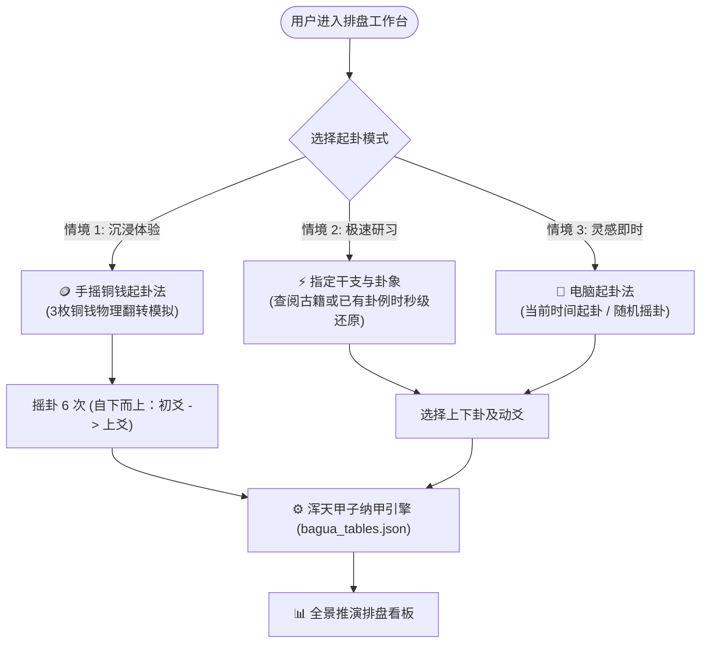
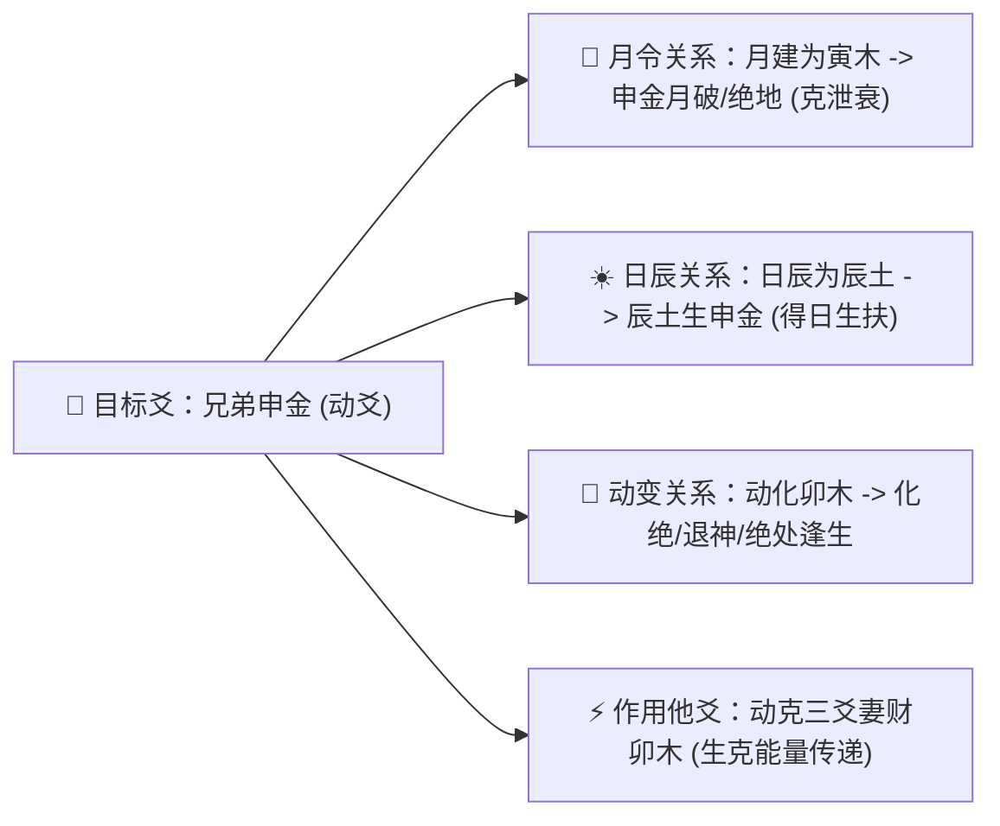

# 第 2 轮规范：智能排盘推演工作台交互与视觉规范

> **规范版本**：v1.0 (已通过第 2 轮三方独立评审与修正)  
> **制定主体**：资深产品设计师 & 现代教育家

---

## 1. 排盘工作台架构与模式设计

排盘是六爻学习与实践的核心工作台。系统提供三种起卦模式，满足从零基础到专业研习者的全场景需求：



---

## 2. 排盘看板全景布局与信息要素 (Board Anatomy)

排盘看板采用模块化响应式网格，分为四大区域：

```
+-----------------------------------------------------------------------------+
| 【顶部环境看板】：干支月令 / 日辰 / 旬空 / 月破 / 占问事由 & 用神设定        |
+-----------------------------------------------------------------------------+
| 【六神栏】 | 【伏神栏】 |       【本卦 (主卦)】       |       【变卦 (之卦)】       |
|  青龙     |  子孙子水  |  --- 父母戌土 (世) 动 [朱砂] |  -- -- 兄弟申金            |
|  朱雀     |  妻财亥水  |  -- -- 兄弟申金             |  -- -- 兄弟申金            |
|  勾陈     |  官鬼丑土  |  --- 官鬼午火               |  --- 官鬼午火              |
|  螣蛇     |  子孙卯木  |  --- 兄弟申金 (应) 动 [朱砂] |  -- -- 妻财卯木            |
|  白虎     |  妻财巳火  |  -- -- 官鬼午火             |  -- -- 官鬼午火            |
|  玄武     |  父母未土  |  -- -- 父母辰土             |  -- -- 父母辰土            |
+-----------------------------------------------------------------------------+
| 【动态生克与理法推演台】：点击任意爻，智能展开其在日月、动爻、变爻下的生克状态 |
+-----------------------------------------------------------------------------+
```

### 2.1 核心字段与排布标准
1. **环境天时头（Header）**：
   - 年月日时四柱干支。
   - **月建**（显示旺相休囚基准，标注本月月破地支）。
   - **日辰**（标注今日旬空支、日冲暗动支）。
   - **占问意向与用神绑定**（如：占求财 -> 绑定妻财；占功名 -> 绑定官鬼；占父母健康 -> 绑定父母）。
2. **本卦与变卦（BenGua & BianGua）**：
   - 卦名、八宫所属（如：乾宫首卦、兑宫三世卦、游魂、归魂）。
   - 六爻六亲、干支、五行、世应标注。
   - **动爻（Moving Line）**：以朱砂红高亮，右侧附带清晰的变动箭头指向变爻。
3. **伏神栏（FuShen Column）**：
   - 依据本卦所属宫位的“本宫纯卦”自动比对，若本卦缺用神，在对应爻位左侧显示伏神六亲与干支。
   - 支持“仅在用神不现时显示”与“常驻半透明显示”一键切换。
4. **六神栏（LiuShen Column）**：
   - 依据日干规则（甲乙起青龙，丙丁起朱雀，戊起勾陈，己起螣蛇，庚辛起白虎，壬癸起玄武）自初爻至上爻严格排布。

---

## 3. 动态推演引擎交互设计 (Dynamic Deduction Engine)

当学习者在排盘看板中点击任意一爻（如：第 4 爻 `兄弟申金 动`）时，底部推演台将触发 **“全景生克显微镜”**：



- **视觉提示**：
  - 点击爻后，与其产生生克刑冲合的其他爻在看板上产生连线或光晕高亮。
  - 自动输出该爻的当前状态标签（如 `[月破]` `[得日生]` `[化绝]` `[克用神]`）。

---

## 4. 第 2 轮三方独立评审与修正纪要 (Round 2 Review & Refinement)

### 4.1 专业设计师评审 (Designer Review)
- **质疑点 1**：摇铜钱时，初学者如果必须摇 6 次，没有动效反馈会非常枯燥，甚至不知道摇到第几爻了。
- **质疑点 2**：六神、伏神、世应、干支、动爻标记混在同一行，信息过于密集，缺乏视觉骨架。
- **设计师改进方案**：
  1. 铜钱摇卦增加物理重力翻转轻量动效，配合“叮”的声音与震动反馈，下方显示 `第 1/6 爻已就绪（初爻）` 的动态步进器。
  2. 采用**分栏表格化排版**，对六神、伏神、爻象、干支五行、世应赋予固定的列宽与微型胶囊徽章（Capsule Badges），形成清晰的网格对齐。

### 4.2 小白用户评审 (Novice User Review)
- **质疑点 1**：摇铜钱时，三枚铜钱的正反面代表什么完全记不住（比如：一个背是少阳还是少阴？三个字是老阳还是老阴？）。
- **质疑点 2**：变卦是怎么来的？为什么有的爻变了，有的爻没变？
- **小白引导改进方案**：
  1. 铜钱界面附带 **“即时图解卡片”**：
     - 一背两字 = ▅▅▅▅▅ (少阳，静爻)
     - 两背一字 = ▅▅　▅▅ (少阴，静爻)
     - 三个背 = ▅▅▅▅▅ ◯ (老阳，动爻 -> 变阴)
     - 三个字 = ▅▅　▅▅ ✕ (老阴，动爻 -> 变阳)
  2. 在变卦上方增加一句通俗小提示：“💡 提示：只有带 ◯ 或 ✕ 的动爻才会发生改变，其余静爻原样保留。”

### 4.3 易学大师评审 (I Ching Master Review)
- **质疑点 1**：伏神的取法绝不能简单从外宫借，必须严格按京房八宫本宫纯卦取！并且必须明确标注“飞神”与“伏神”的生克关系（飞来克伏为伤身，伏去克飞为出暴）。
- **质疑点 2**：动爻的“回头生、回头克、化进神、化退神”是野鹤断卦的核心精髓，必须在变卦中明确标出！
- **大师考订改进方案**：
  1. 伏神算法严格对照 `bagua_tables.json` 中的八宫纯卦标准映射，当点击伏神时，自动高亮覆盖在它上面的“飞神”，并显示飞伏生克判断（如“伏克飞”、“飞生伏”）。
  2. 动爻变出之爻若构成“回头生/回头克/化进化退”，在动变箭头上直接呈现专属标识（如 `➯ ▅▅▅ 回头生` 或 `➯ ▅▅▅ 化退`）。
