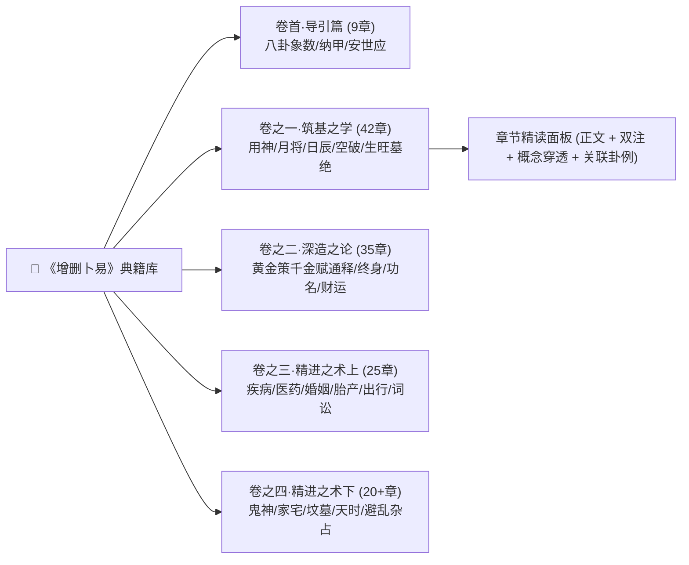

# 第 3 轮规范：典籍沉浸式精读器与术语穿透体系

> **规范版本**：v1.0 (已通过第 3 轮三方独立评审与修正)  
> **制定主体**：资深产品设计师 & 现代教育家

---

## 1. 典籍阅读器架构与分卷导航

系统将《增删卜易》李文辉序定本的全部章节（存储于 `src/data/chapters.json`）按照五大篇章构建结构化目录树：



---

## 2. 古籍多维双注排印与阅读工效学 (Typography & Layout)

### 2.1 版式与视觉分层
为了同时满足“原汁原味古籍研读”与“现代高效理解”，正文区域采用**分层胶囊注疏排版**：

```
+--------------------------------------------------------------------------------+
| 【章节标题】：卷之一·第二十四章 旬空章第二十四                                 |
+--------------------------------------------------------------------------------+
| [原文段落]                                                                     |
| 旬空者，如甲子旬中无戌亥，甲戌旬中无申酉是也。                                 |
| 诸书皆以旬空为凶，独野鹤谓：【旬空】[🔗穿透] 乃神圣之先机，不可概以凶断。     |
+--------------------------------------------------------------------------------+
| ▎【野鹤秘传按语】                                                             |
| 野鹤曰：动不为空，旺不为空，日辰生扶不为空。若休囚无气又逢日冲克，方为真空。   |
+--------------------------------------------------------------------------------+
| ▎【李文辉评注】                                                               |
| 李文辉曰：前人执泥空亡，见空便断为破散，不知真空假空之辨，此章真千古不传之秘。 |
+--------------------------------------------------------------------------------+
| 💡【现代白话导读与核心速记】                                                  |
| 本章核心要旨：旬空不代表永远消失。只要自身旺相、有动爻或日生，出空之日即可应验。|
+--------------------------------------------------------------------------------+
| 🔍【本章关联实战卦例 (3例)】 [点击展开查看：如《占病逢旬空案》]               |
+--------------------------------------------------------------------------------+
```

### 2.2 阅读辅助控制台
- **字号与行距调节**：支持三种舒适度预设（Compact 紧凑 / Normal 标准 / Spacious 宽松）。
- **注解图层切换（Layer Filters）**：支持一键开关【野鹤按语】、【李文辉评语】、【白话导读】、【古籍例题】，满足不同水平读者需求。
- **划词释义与书签笔记**：选中任意文本可快速生成读书笔记或在社区研习区发起讨论。

---

## 3. 术语概念全景穿透系统 (Concept Transclusion & Hover Cards)

在阅读典籍或浏览排盘时，系统自动识别收录在 `src/data/concepts.json` 中的 50+ 个核心易学概念（如：`月破`、`旬空`、`反吟`、`伏吟`、`随鬼入墓`、`进神退神`、`贪生忘克`、`暗动`等）。

### 3.1 术语浮窗卡片设计规范 (Hover Card Spec)
当光标悬停或点击带有虚线下划线 `[概念]` 的术语时，弹出 320px 宽度的沉浸式穿透卡片：

```
+-------------------------------------------------------------+
| 📚 概念穿透：月破 (YuePo)                       [核心法则]  |
+-------------------------------------------------------------+
| 【极简定义】：爻支与当月月建相冲（如正月建寅，爻见申金）。   |
| 【力量定性】：主大凶、衰弱、事无成。若日辰动爻生扶，出月可救。|
| 【断卦歌诀】：月破之爻莫算强，纵然动变也难当。               |
|              若逢生合出月好，休囚死绝永无光。               |
+-------------------------------------------------------------+
| 📊 典型原著卦例：                                           |
| 1. 《巳月占官运，官化申金月破案》 -> [点击直达盲推研习]       |
| 2. 《申月占防贼，世临寅木逢月破案》 -> [点击直达盲推研习]     |
+-------------------------------------------------------------+
```

---

## 4. 第 3 轮三方独立评审与修正纪要 (Round 3 Review & Refinement)

### 4.1 专业设计师评审 (Designer Review)
- **质疑点 1**：如果一篇文章里到处都是术语下划线，会导致页面视觉破碎（Visual Noise），让读者产生阅读干扰。
- **质疑点 2**：浮窗在屏幕边缘或移动端容易超出视口被截断。
- **设计师改进方案**：
  1. 术语下划线采用极低对比度的灰点下划线（`border-bottom: 1px dashed var(--text-tertiary)`），只有在鼠标 Hover 或开启“学习辅助高亮”模式时才凸显。
  2. 采用 Floating-UI 智能视口边缘碰撞检测算法，移动端改用自底部弹出的抽屉式卡片（Bottom Sheet Drawer）。

### 4.2 小白用户评审 (Novice User Review)
- **质疑点 1**：古籍里的通假字和古文语法太难懂，光给几个概念解释，整句话还是读不顺。
- **质疑点 2**：想找“怎么看我今年能不能升职”的内容，但古籍目录全是“卷之二求名章”、“官运章”，不知道怎么搜。
- **小白引导改进方案**：
  1. 每章提供**“白话极简大意”与“一句话心法速记”**，位于原文下方，并以浅墨绿淡背景色块区隔。
  2. 提供**“现代生活场景搜索指南”**（如：搜“跳槽/加薪/买房/考试/找猫”，自动重定向到对应的《增删卜易》原著章节）。

### 4.3 易学大师评审 (I Ching Master Review)
- **质疑点 1**：野鹤老人的很多论断是对前人伪书（如《卜筮全书》、《断易天机》）的批判，如果只展示野鹤的话，读者不知野鹤为何而发、辟了何谬。
- **质疑点 2**：《黄金策·千金赋》是六爻宗经，野鹤老人的逐句删补批注是全书最高光部分，必须作为特辑独立精排！
- **大师考订改进方案**：
  1. 增加“野鹤辟谬对比视窗（Debunking View）”：列出前人旧说（如神煞套用） vs 野鹤实验证据（百占百验之法则）。
  2. 针对卷之二《增删黄金策千金赋》，设计“赋文-野鹤原批-李文辉增注”的三栏经典注疏特辑视图。
