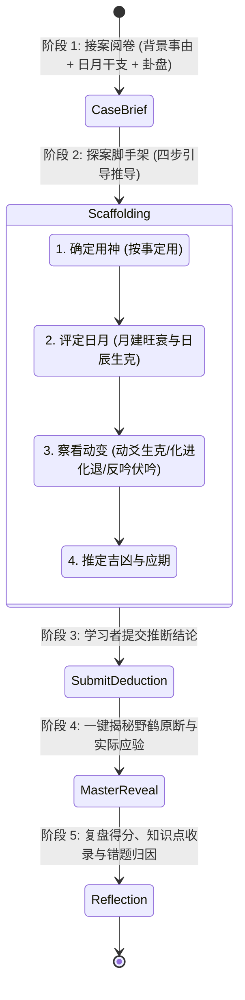

# 第 4 轮规范：古籍实战卦例研习与“盲推探案”推演规范

> **规范版本**：v1.0 (已通过第 4 轮三方独立评审与修正)  
> **制定主体**：资深产品设计师 & 现代教育家

---

## 1. 案例研习与“盲推探案”系统设计哲学

《增删卜易》全书收录了 400 余个真实断卦案例（存储于 `src/data/cases.json`）。传统被动阅读卦例的弊端在于“事后诸葛亮”效应——读者直接看到结果，误以为自己掌握了断法，一旦自己遇卦依然茫然。

本模块采用现代认知心理学中的 **主动回忆（Active Recall）与认知脚手架（Scaffolding）**，将案例转化为**“六爻神探解谜游戏”**：



---

## 2. 盲推探案工作台交互界面规范

### 2.1 界面布局标准
```
+--------------------------------------------------------------------------------+
| 🕵️ 【六爻神探·第 042 案】：卯月 戊辰日 占官运功名能否得中                      |
+--------------------------------------------------------------------------------+
| ▎【盘面证据】                                                                  |
|   月建：卯木 (官鬼)      日辰：辰土 (兄弟，空戌亥)                             |
|   本卦：火地晋 (乾宫游魂)  变卦：火风鼎                                        |
|   [查看六爻干支排盘... 动爻朱砂高亮显示]                                       |
+--------------------------------------------------------------------------------+
| ▎【侦探思考脚手架 (Step-by-Step)】                                             |
|   1. 🎯 本案用神应取哪一爻？                                                    |
|      [ ] 世爻父母未土  [ ] 官鬼巳火 (上爻) [x] 官鬼卯木 (二爻) [ ] 妻财子水   |
|                                                                                |
|   2. 📅 用神在日月下的旺衰状态？                                               |
|      [x] 临月建大旺，得日辰辰土生扶/比和  [ ] 月破休囚死绝                      |
|                                                                                |
|   3. ⚡ 动爻产生了何种关键影响？                                               |
|      [x] 初爻妻财卯木动化进神生助用神    [ ] 子孙动克官鬼                      |
|                                                                                |
|   4. ⚖️ 你的最终吉凶判断是？                                                   |
|      [x] 必中/必升迁       [ ] 不中/受阻                                       |
|      应期推断：[  巳月升迁  ] (选填或手写)                                     |
|                                                                                |
|   [ 🚀 提交我的推断并揭晓野鹤断语 (Ctrl+Enter) ]                               |
+--------------------------------------------------------------------------------+
```

### 2.2 揭晓与复盘阶段 (Reveal & Reflection)
当用户点击“提交推断”后，系统以优雅的展开动效呈现：
1. **野鹤老人原著断语**：高亮原著中的关键分析逻辑（如：“*野鹤曰：官临月建，又化进神，烈火烹油之势，今科必中无疑...*”）。
2. **后验记录**：展示事后真实应验（“*果于四月巳日得中进士，后选知县...*”）。
3. **得分与雷达图**：评估用户在“取用神准确度”、“日月生克理解”、“动变捕捉”、“应期判断”四个维度的命中率。
4. **一键存入错题本/强化本**：支持将本案标记为“需巩固”并加入间隔复习队列。

---

## 3. 400+ 案例多维检索与研习矩阵

在案例馆首页，学习者可通过多重维度精准检索案例：
- **按事类专题**：功名官运（52例）、商贾求财（48例）、疾病医药（60例）、婚姻子嗣（38例）、出行词讼（30例）、天时杂占（40例）。
- **按核心法则**：旬空专题、月破专题、绝处逢生专题、反吟伏吟专题、随鬼入墓专题、进退神专题。
- **按难度阶梯**：入门明了案（单动爻、旺衰分明） / 进阶辨疑案（动多变杂、飞伏并见） / 宗师破迷案（反常理、暗动独发）。

---

## 4. 第 4 轮三方独立评审与修正纪要 (Round 4 Review & Refinement)

### 4.1 专业设计师评审 (Designer Review)
- **质疑点 1**：如果每次都要求做 4 道选择题才给看答案，会导致重度研习用户（只想快速刷案例的人）感到繁琐疲劳。
- **质疑点 2**：提交答案前后的界面高度突变，容易造成视觉跳动。
- **设计师改进方案**：
  1. 提供双模式切换：**“探案训练模式（Scaffolding Mode）”**（完整 4 步引导）与 **“快速研习模式（Express Mode）”**（仅需心里想答案，一键点击“翻转查看原断”）。
  2. 采用 CSS View Transitions 保证揭秘过程平滑展开，不发生突兀位移。

### 4.2 小白用户评审 (Novice User Review)
- **质疑点 1**：刚学的小白根本不知道应期怎么猜，应期选填会让新手产生巨大挫败感。
- **质疑点 2**：如果选错了，直接给个红叉会很打击积极性。
- **小白引导改进方案**：
  1. 应期部分设为“可选附加题”，并在下方提供【💡 侦探线索提示】：点击展开“提示：观察动爻或用神在哪个地支逢合/逢值/出空”。
  2. 错误反馈采用**鼓励式复盘（Constructive Feedback）**，明确提示：“您已准确找出了用神，唯在动爻生克上忽略了‘贪生忘克’，点击查看该法则详解”。

### 4.3 易学大师评审 (I Ching Master Review)
- **质疑点 1**：很多案例的妙处在于野鹤老人对“求占者最初隐瞒实情”或“同一卦不同人断出截然相反结果”的心理与易理洞察，不仅是简单的吉凶符号判断。
- **质疑点 2**：卦例必须标注对应的原著出处卷次和章节号，方便追溯典籍上下文。
- **大师考订改进方案**：
  1. 增加“野鹤断易精微点评（Insight Note）”模块，提炼案例背后的人情世故、占筮心理与易理精义。
  2. 每个案例卡片右上角标注清晰的典籍锚点（如 `[卷之一·用神章例 3]`），点击可双向跳转精读。
