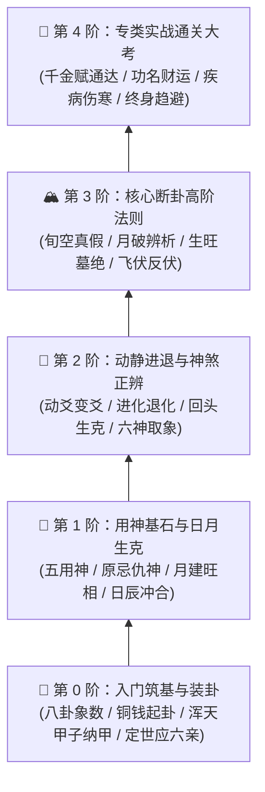
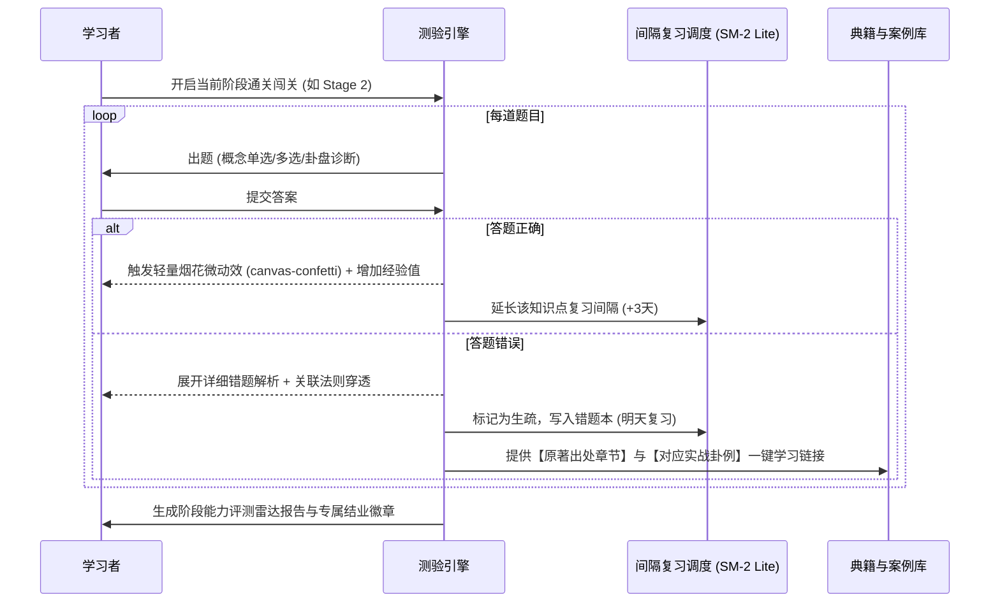

# 第 5 轮规范：认知进阶树、闯关测试与评估复盘体系

> **规范版本**：v1.0 (已通过第 5 轮三方独立评审与修正)  
> **制定主体**：资深产品设计师 & 现代教育家

---

## 1. 五阶认知进阶树体系设计 (5-Tier Mastery Path)

系统根据现代教育学中的“最近发展区（ZPD）”与布鲁姆教育目标分类学，将全书知识体系（基于 `src/data/knowledge_tree.json`）解构为循序渐进的五大阶梯：

### 1.1 各阶核心掌握指标与能力画像

| 阶梯编号 | 阶梯名称 | 核心技能画像 (Key Skills) | 关联典籍章节数 | 通关测验题量 |
| :--- | :--- | :--- | :--- | :--- |
| **Stage 0** | 入门筑基与装卦 | 能独立手摇起卦、自如完成八宫纳甲与安世应、六亲配属 | 卷首 1~9 章 | 15 题 (基础测验) |
| **Stage 1** | 用神基石与日月 | 精准取用神、掌握月将主一月之权、日辰司百日之柄的生克律 | 卷一 1~15 章 | 20 题 (核心辨析) |
| **Stage 2** | 动静进退与神煞 | 识别动爻力量传递、化进神退神、六神心理取象、辨伪杂神煞 | 卷一 16~28 章 | 20 题 (推演测验) |
| **Stage 3** | 核心断卦法则 | 熟稔真空假空、月破可救与难当、长生十二宫、伏神得出与受制 | 卷一 29~42 章 | 25 题 (高阶挑战) |
| **Stage 4** | 专类实战通关 | 融会贯通《千金赋》、能够独立推演疾病、功名、财运等复杂卦 | 卷二~卷四全集 | 30 题 (实战盲推) |

---

## 2. 闯关测试引擎与智能复盘机制 (Quiz & Review Engine)

系统集成 `src/data/quizzes.json` 中的多维题库，构建包含即时正向反馈的测验交互流：

### 2.1 错题本与间隔重复算法 (SM-2 Lite Spaced Repetition)
- 系统根据学习者的历史作答记录计算记忆遗忘曲线：
  - 连对 1 次：1 天后复习
  - 连对 2 次：3 天后复习
  - 连对 3 次：7 天后复习
  - 连对 4 次：21 天后复习
  - 一旦答错：立即重置复习周期为 0，并在次日推送相同知识点的变式题目。

---

## 3. 第 5 轮三方独立评审与修正纪要 (Round 5 Review & Refinement)

### 3.1 专业设计师评审 (Designer Review)
- **质疑点 1**：很多学习软件的技能树界面做成枯燥的列表，缺乏成就感与探索欲。
- **质疑点 2**：答对题目时的奖励动效如果过于频繁会造成干扰，过弱又缺乏愉悦感。
- **设计师改进方案**：
  1. 采用**“水墨山水卷轴进阶图”**：从山脚（筑基）一路向上延伸至山巅（通神），完成关卡节点点亮金色篆刻印章。
  2. 测验过程中采用轻量柔和的微动效（微小金色微粒 + 柔和音效），完成一整套测验时才触发全局欢庆动效。

### 3.2 小白用户评审 (Novice User Review)
- **质疑点 1**：做错题后最讨厌只显示“正确答案是 C”，完全不知道为什么选 C，也不知道从哪本书找。
- **质疑点 2**：如果通关失败要全部重做，会导致直接放弃。
- **小白引导改进方案**：
  1. 错误解析实施**“三段式闭环”**：
     - ① 错因直击（“你误将日辰之克当成了动爻生克”）；
     - ② 核心法则歌诀；
     - ③ 一键跳转到《增删卜易》对应章节（[`chapters.json`](file:///home/ubuntu/yi/src/data/chapters.json)）与实战卦例（[`cases.json`](file:///home/ubuntu/yi/src/data/cases.json)）。
  2. 关卡支持“随时存档”与“错题重练重计分”，不强制重头再来。

### 3.3 易学大师评审 (I Ching Master Review)
- **质疑点 1**：题目必须严谨无争议，六爻断法流派众多（如新派与传统盲派各执一词），题目答案必须 100% 严格以野鹤老人《增删卜易》原文为唯一真理标准！
- **质疑点 2**：必须设立“野鹤辟谬专项考”，考查学习者能否识别伪法（如妄信神煞、死守五行死板克法而不知贪生生克）。
- **大师考订改进方案**：
  1. 题库中所有题目均在题干末尾明确标注“*（依据野鹤老人《增删卜易》定则）*”，杜绝流派争议干扰。
  2. 在 Stage 2 和 Stage 3 增加专属**“辟伪辨谬考题集”**，重点考核对伪神煞、假空破的辨伪能力。
