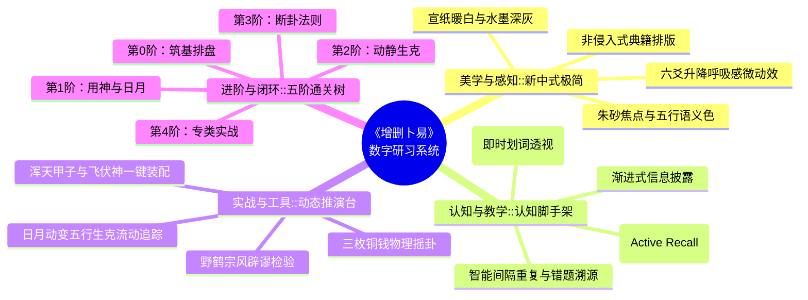

# 《增删卜易》数字化研习系统：设计总览与核心教育哲学

> **系统代号**：Yi-Mastery (增删卜易·数字研习工作台)  
> **核心定位**：专为现代学习者打造的高互动、强沉浸、重实战的六爻易学数字化学习与推演系统  
> **设计主旨**：融汇**新中式极简美学（Neo-Chinese Minimalist）**与**现代认知科学脚手架（Cognitive Scaffolding）**

---

## 1. 系统核心愿景与设计哲学

传统研读《增删卜易》常陷于“文言艰深、装卦繁琐、概念繁杂、死记断语”的困境。本项目基于资深产品设计师与现代教育家的双重设计原则，提出四大核心设计基石：

---

## 2. 核心教育学方法论 (Pedagogy Methodology)

### 2.1 主动回忆与盲推探案 (Active Recall via Blind Deduction)
- **问题**：传统读卦例，读者眼睛一扫直接看到“野鹤曰：此卦必得官，后果于某月升迁”，大脑并未产生神经联结。
- **方案**：引入**“六爻探案模式”**，先展示占问背景与卦盘，遮盖断语和结果，提供分步认知脚手架（确定用神 -> 评判日月旺衰 -> 分析动爻生克 -> 判定吉凶应期），由学习者主动推导后，一键揭秘对比，极大强化理解与记忆。

### 2.2 概念即时穿透 (Concept Transclusion & Hover Cards)
- **问题**：初学者在读古籍或看卦盘时，遇到“反吟”、“绝处逢生”、“贪生忘克”、“随鬼入墓”等术语时往往需中断阅读去翻书。
- **方案**：构建**全景术语穿透图谱**。任何术语在原文、卦盘、解析中均呈现轻量可交互标记，Hover/点击即展示极简定义、图解示例、核心歌诀以及《增删卜易》中对应典型卦例。

### 2.3 双重编码理论 (Dual-Coding Theory)
- 将抽象的“干支五行生克”转化为**可视化的能量流动**（如：申金动生子水，盘面上呈现柔和的金色到蓝色流向指示，并标注“生/克/合/冲”关系），文字与图解双轨刺激，降低认知过载。

---

## 3. 三方独立评审角色体系 (Evaluation Personas)

本规范历经 **5 轮独立严格评审与迭代**，每轮均由以下三位具代表性的角色发起质询与修正：

| 角色 | 代表视角 | 关注核心与评审标准 |
| :--- | :--- | :--- |
| **🎨 专业设计师** | 高级 UI/UX 设计师 | 视觉层级韵律、WCAG 可访问性、新中式色彩与排版规范、微交互反馈、多端自适应工效 |
| **🌱 小白用户** | 零基础易学爱好者 | 零术语冷启动友好度、操作容错性、防挫败感、清晰指引与成就感反馈 |
| **📜 易学大师** | 野鹤宗风传人 / 资深学者 | 京房易与六爻装卦绝对精确度、野鹤老人“唯重日月动爻用神、破除虚妄神煞”的宗风体现 |

---

## 4. 规范文档目录索引

- [01. 全局信息架构与新中式视觉规范](file:///home/ubuntu/yi/docs/design_system/01_ia_and_design_system.md)
- [02. 智能排盘推演工作台交互规范](file:///home/ubuntu/yi/docs/design_system/02_paipan_workbench_spec.md)
- [03. 典籍沉浸式精读器与术语穿透体系](file:///home/ubuntu/yi/docs/design_system/03_reader_and_concepts_spec.md)
- [04. 古籍实战卦例研习与“盲推探案”推演规范](file:///home/ubuntu/yi/docs/design_system/04_case_deduction_game_spec.md)
- [05. 认知进阶树、闯关测试与评估复盘体系](file:///home/ubuntu/yi/docs/design_system/05_knowledge_tree_and_mastery_spec.md)
- [06. 5 轮多角色独立评审与迭代全景报告](file:///home/ubuntu/yi/docs/design_system/06_multi_persona_eval_report.md)
- [组件蓝图库](file:///home/ubuntu/yi/docs/design_system/components_blueprint/)
  - [六爻卦象排盘组件蓝图 (PaipanCardLayout)](file:///home/ubuntu/yi/docs/design_system/components_blueprint/PaipanCardLayout.md)
  - [盲推探案状态机规范 (CaseDeductionFlow)](file:///home/ubuntu/yi/docs/design_system/components_blueprint/CaseDeductionFlow.md)
  - [术语穿透浮窗设计规范 (ConceptPopverSpec)](file:///home/ubuntu/yi/docs/design_system/components_blueprint/ConceptPopverSpec.md)
