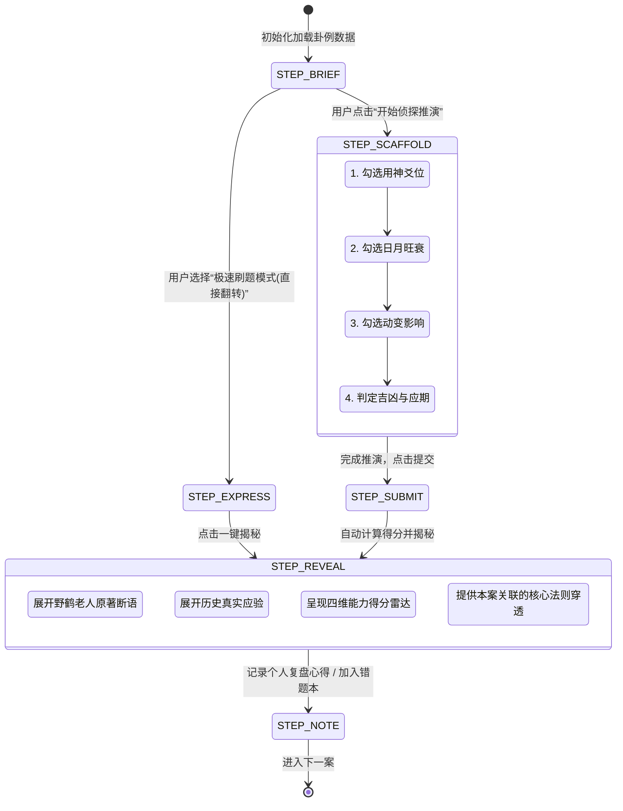

# 组件蓝图：六爻探案盲推交互流程状态机 (CaseDeductionFlow)

> **⚠️ 已废弃**：对应的 `CaseDeductionHub.jsx` 已删除，实例模块改按新数据模型（`cases`/`records`）与标签筛选界面重建，不再是答题状态机。本文档仅作历史存档保留。

> **组件定位**：案例研习馆“盲推探案”四步推演状态机与交互组件  
> **适用场景**：400+ 古籍实战卦例闯关研习、高阶模拟排盘考核

---

## 1. 状态机构建 (Finite State Machine)



---

## 2. 状态定义与 Types (TypeScript)

```typescript
export interface CaseItem {
  id: string;                 // 如 'case_042'
  title: string;              // 如 '卯月戊辰日占官运'
  chapterId: string;          // 关联章节 'ch_015'
  question: string;           // 占问事由
  dateGanzhi: {
    month: string;
    day: string;
    xunKong: string;
  };
  benGua: string;
  bianGua: string;
  movingYaos: number[];       // 动爻位置 [1, 4]
  yongShenExpected: string;   // 标准用神 '二爻官鬼卯木'
  originalMasterDeduction: string; // 野鹤老人原断语
  actualOutcome: string;      // 实际应验结果
  keyRuleTags: string[];      // ['进神', '月建生扶', '化绝']
  difficulty: 'beginner' | 'intermediate' | 'advanced';
}

export interface UserDeductionInput {
  selectedYongShen: string;
  monthDayEffect: 'strong' | 'weak' | 'broken';
  movingTrend: string;
  predictedOutcome: 'auspicious' | 'inauspicious';
  predictedTiming?: string;
  notes?: string;
}
```

---

## 3. 交互设计要点与防挫败机制

1. **渐进式线索提示 (Progressive Clues)**：
   - 当用户在某一题停留超过 30 秒或点击【💡 寻求线索】时，弹出第一级微提示（如：“提示：占自身前程，以官鬼为用神，注意二爻与上爻的区别”）。
2. **非强制性应期输入 (Optional Timing)**：
   - 新手可跳过应期直接判定吉凶；中高级研习者填写应期将获得额外的“宗师神断”徽章加分。
3. **沉浸式展开动效 (View Transition & Card Flip)**：
   - 揭晓答案时，不进行整页刷新，而是以卡片翻转与柔和的光晕动效平滑呈现野鹤断语。
